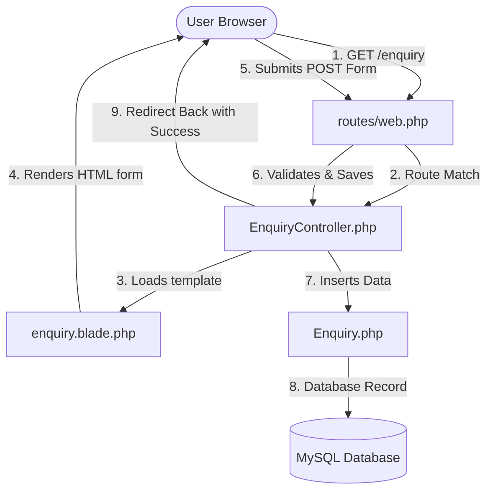

# Enquiry Form System (Laravel Project)

A clean, responsive, and fully-functional **Enquiry Form System** built with Laravel 12.x, PHP 8.2, and MySQL.

---

## 🛠️ Features
- **Clean Responsive Form**: A light-themed, modern form utilizing standard inputs (`Full Name`, `Email Address`, `Phone Number`, `Subject`, and `Message`).
- **Form Validation**: Server-side error validation with dynamic helper feedback using Laravel `@error` directives.
- **Persistent Data**: Preserves user input across validation errors using `old()` helper.
- **Notification Banner**: Displays clear success and warning feedback alerts on action completion.
- **Root URL Access**: Seamlessly forwards the home route `/` directly to the enquiry form.

---

## 💾 Database Schema

The system uses the `enquiries` table with the following layout:

| Field | Type | Attributes | Description |
|---|---|---|---|
| **id** | `BIGINT` | Auto-Increment, Primary Key | Unique ID of the enquiry |
| **name** | `VARCHAR(255)` | Nullable | Full name of the sender |
| **email** | `VARCHAR(255)` | Required | Email address of the sender |
| **phone** | `VARCHAR(15)` | Nullable | Contact number (up to 15 digits) |
| **subject** | `VARCHAR(255)` | Nullable | Message subject line |
| **message** | `TEXT` | Required | Detailed body text |
| **created_at** | `TIMESTAMP` | Nullable | Creation timestamp |
| **updated_at** | `TIMESTAMP` | Nullable | Last update timestamp |

---

## 🧭 Routes

All extra routes have been cleaned up. The application exposes the following endpoints:

| Method | URI | Action | Route Name | Description |
|---|---|---|---|---|
| **GET** | `/` | `EnquiryController@create` | `enquiry.create` | Displays enquiry form at home |
| **GET** | `/enquiry` | `EnquiryController@create` | N/A | Displays enquiry form |
| **POST** | `/enquiry` | `EnquiryController@store` | `enquiry.store` | Submits form & saves to database |

---

## 🔧 Bug Fixes Completed

1. **Unknown Column Errors**:
   - The initial database migration was missing the target columns (`email`, `phone`, `subject`, `message`). 
   - Consolidated all columns into the main `create_enquiries_table` migration, removed the redundant `add_name_to_enquiries_table` migration, and rebuilt the database using `php artisan migrate:fresh`.
2. **Method Not Allowed HTTP Exception (405)**:
   - Fixed route errors where direct `GET` requests to `/enquiry` threw errors by registering an explicit GET handler.
3. **Redundant Code Removal**:
   - Cleaned up the views directory, keeping only the [enquiry.blade.php](resources/views/enquiry.blade.php) form template.
   - Removed all unused controller files (`FeedbackController.php`) and old test views.

---

## 🚀 How to Run

1. **Configure Environment (`.env`)**:
   Ensure your database connection details are correctly set up in your `.env` file:
   ```env
   DB_CONNECTION=mysql
   DB_HOST=127.0.0.1
   DB_PORT=3306
   DB_DATABASE=emr_software
   DB_USERNAME=root
   DB_PASSWORD=
   ```
2. **Execute Database Migrations**:
   ```bash
   php artisan migrate
   ```
3. **Start Local PHP Server**:
   ```bash
   php artisan serve
   ```
4. **Access in Browser**:
   * Home URL: [http://127.0.0.1:8000](http://127.0.0.1:8000)
   * Enquiry URL: [http://127.0.0.1:8000/enquiry](http://127.0.0.1:8000/enquiry)

---

## 🎓 Beginner-Friendly MVC Architecture Guide

To understand how the enquiry form works under the hood, here is a simple breakdown of the Model-View-Controller (MVC) flow used in this application:



### 1. The Route (The Map)
Defined in [routes/web.php](routes/web.php), the route directs incoming URLs to the correct controller methods:
* `Route::get('/enquiry', ...)` matches when someone visits the page.
* `Route::post('/enquiry', ...)` matches when someone submits the form.

### 2. The Controller (The Brain)
Located at [app/Http/Controllers/EnquiryController.php](app/Http/Controllers/EnquiryController.php):
* **`create()`**: Loads and returns the [enquiry.blade.php](resources/views/enquiry.blade.php) view.
* **`store()`**: 
  1. Checks if user inputs are valid (e.g. valid email, not too long).
  2. Uses the **Model** to save data to the database.
  3. Redirects the user back to the form with a success session message.

### 3. The Model (The Data Gateway)
Located at [app/Models/Enquiry.php](app/Models/Enquiry.php):
* Represents the `enquiries` database table in PHP code.
* The `$fillable` array lists fields we can mass-assign (`name`, `email`, `phone`, `subject`, `message`), keeping database queries safe.

### 4. The View (The Presentation)
Located at [resources/views/enquiry.blade.php](resources/views/enquiry.blade.php):
* HTML & CSS code to render the form.
* **`@csrf`**: Adds security tokens to prevent form spoofing.
* **`old('field_name')`**: Restores previously entered data if the validation fails.
* **`session('success')`**: Automatically shows a success message alert box when the form submits cleanly.
