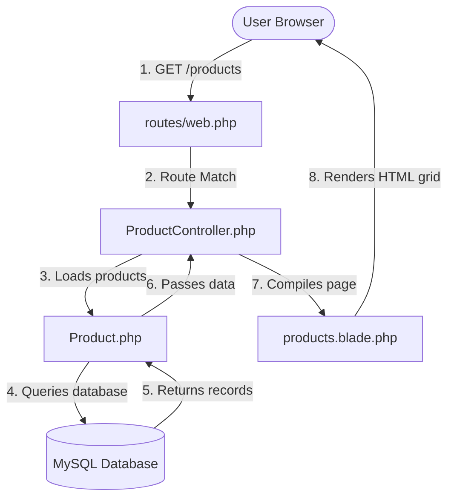

# Enquiry & Product Catalog System (Laravel Project)

A clean, responsive, and fully-functional **Enquiry & Product Catalog System** built with Laravel 12.x, PHP 8.2, and MySQL.

---

## 🛠️ Features
- **Enquiry Form**: A light-themed, modern form utilizing standard inputs (`Full Name`, `Email Address`, `Phone Number`, `Subject`, and `Message`) with server-side validation and persistent inputs.
- **Product Catalog**: A beautiful, card-based responsive product display grid with interactive filter elements, feature highlights, and stock tags.
- **Form Validation**: Server-side error validation with dynamic helper feedback using Laravel `@error` directives.
- **Persistent Data**: Preserves user input across validation errors using `old()` helper.
- **Notification Banner**: Displays clear success and warning feedback alerts on action completion.
- **Root URL Access**: Seamlessly forwards the home route `/` directly to the enquiry form.

---

## 💾 Database Schema

### 1. `enquiries` Table
| Field | Type | Attributes | Description |
|---|---|---|---|
| **id** | `BIGINT` | Auto-Increment, Primary Key | Unique ID of the enquiry |
| **name** | `VARCHAR(255)` | Nullable | Full name of the sender |
| **email** | `VARCHAR(255)` | Required | Email address of the sender |
| **phone** | `VARCHAR(15)` | Nullable | Contact number (up to 15 digits) |
| **subject** | `VARCHAR(255)` | Nullable | Message subject line |
| **message** | `TEXT` | Required | Detailed body text |
| **created_at** | `TIMESTAMP` | Nullable | Creation timestamp |
| **updated_at** | `TIMESTAMP` | Nullable | Last update timestamp |

### 2. `products` Table
| Field | Type | Attributes | Description |
|---|---|---|---|
| **id** | `BIGINT` | Auto-Increment, Primary Key | Unique product ID |
| **product_code** | `VARCHAR(255)` | Unique, Nullable | Sku or product code |
| **name** | `VARCHAR(255)` | Required | Name of the product |
| **category** | `VARCHAR(255)` | Nullable | Product classification group |
| **brand** | `VARCHAR(255)` | Nullable | Brand maker |
| **short_description** | `TEXT` | Nullable | Short summary description |
| **description** | `TEXT` | Nullable | Full item details |
| **price** | `DECIMAL(10,2)` | Required | Base price amount |
| **discount** | `DECIMAL(10,2)` | Default `0.00` | Discount percentage |
| **final_price** | `DECIMAL(10,2)` | Nullable | Pre-calculated discount price |
| **stock_quantity** | `INT` | Default `0` | Available stock count |
| **min_stock_level** | `INT` | Default `0` | Reorder warning threshold |
| **is_available** | `TINYINT(1)` | Default `1` (true) | If product is active |
| **timestamps** | `TIMESTAMP` | Nullable | Created & Updated times |

---

## 🧭 Routes

The application exposes the following endpoints:

| Method | URI | Action | Route Name | Description |
|---|---|---|---|---|
| **GET** | `/` | `EnquiryController@create` | `enquiry.create` | Displays enquiry form at home |
| **GET** | `/enquiry` | `EnquiryController@create` | N/A | Displays enquiry form |
| **POST** | `/enquiry` | `EnquiryController@store` | `enquiry.store` | Submits form & saves to database |
| **GET** | `/products` | `ProductController@index` | `products.index` | Renders the responsive product catalog |

---

## 🔧 Bug Fixes Completed

1. **Unknown Column Errors**:
   - The initial database migration was missing the target columns (`email`, `phone`, `subject`, `message`). 
   - Consolidated all columns into the main `create_enquiries_table` migration, removed the redundant `add_name_to_enquiries_table` migration, and rebuilt the database using `php artisan migrate:fresh`.
2. **Method Not Allowed HTTP Exception (405)**:
   - Fixed route errors where direct `GET` requests to `/enquiry` threw errors by registering an explicit GET handler.
3. **Redundant Code Removal**:
   - Cleaned up the views directory, keeping only the [enquiry.blade.php](resources/views/enquiry.blade.php) form template.
   - Removed all unused controller files (`FeedbackController.php`) and old test views.
4. **Model Mismatch Fixes**:
   - Expanded the product migration schema parameters to match all model properties within [Product.php](app/Models/Product.php).
5. **Trait Compilation Fix**:
   - Resolved a compile-time error where `Product` model class imports were incorrectly placed inside the base abstract `Controller` class body, causing PHP to mistake them for Traits. Kept base controller standard and cleaned up imports in [ProductController.php](app/Http/Controllers/ProductController.php).

---

## 🚀 How to Run

1. **Configure Environment (`.env`)**:
   Ensure your database connection details are correctly set up in your `.env` file:
   ```env
   DB_CONNECTION=mysql
   DB_HOST=127.0.0.1
   DB_PORT=3306
   DB_DATABASE=emr_software
   DB_USERNAME=root
   DB_PASSWORD=
   ```
2. **Execute Database Migrations**:
   ```bash
   php artisan migrate:fresh
   ```
3. **Start Local PHP Server**:
   ```bash
   php artisan serve
   ```
4. **Access in Browser**:
   * Home/Enquiry URL: [http://127.0.0.1:8000/enquiry](http://127.0.0.1:8000/enquiry)
   * Product Catalog URL: [http://127.0.0.1:8000/products](http://127.0.0.1:8000/products)

---

## 🐙 Git Setup & Deployment

To initialize and push this repository to your GitHub account, run the following commands:

```bash
# Initialize local Git repository
git init

# Add all files to staging area
git add .

# Create initial commit
git commit -m "Initial commit - Laravel Enquiry System"

# Rename branch to main
git branch -M main

# Add origin remote link
git remote add origin https://github.com/suhaimali/laravel-enquiry-system.git

# Push code to main branch
git push -u origin main
```

---

## 🎓 Beginner-Friendly MVC Architecture Guide

To understand how the enquiry form and product catalog work under the hood, here is a simple breakdown of the Model-View-Controller (MVC) flow:



### 1. The Route (The Map)
Defined in [routes/web.php](routes/web.php), the route directs incoming URLs to the correct controller methods:
* `Route::get('/enquiry', ...)` matches when someone visits the enquiry page.
* `Route::resource('products', ...)` generates RESTful paths automatically, forwarding `/products` requests to the `ProductController`.

### 2. The Controller (The Brain)
* **`EnquiryController`**: Loads and handles validation + storage of enquiry forms.
* **`ProductController`**: Fetches available products from the database via the model and passes them to the [products.blade.php](resources/views/products.blade.php) view.

### 3. The Model (The Data Gateway)
* Represents your database table structures in PHP code.
* The `$fillable` array inside the models ensures safe mass-assignment queries when storing or editing details.

### 4. The View (The Presentation)
* Contains the markup and styles.
* Displays dynamic data dynamically using Blade syntax looping structures (e.g. `@foreach`).
